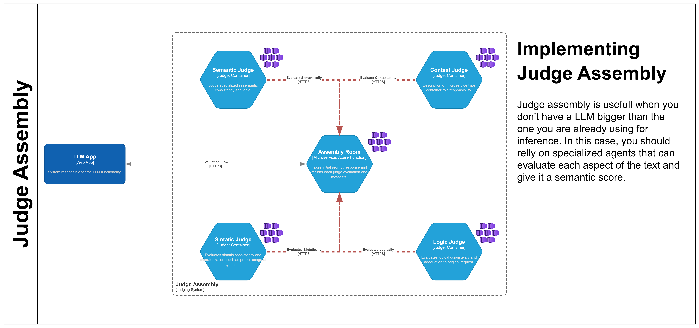
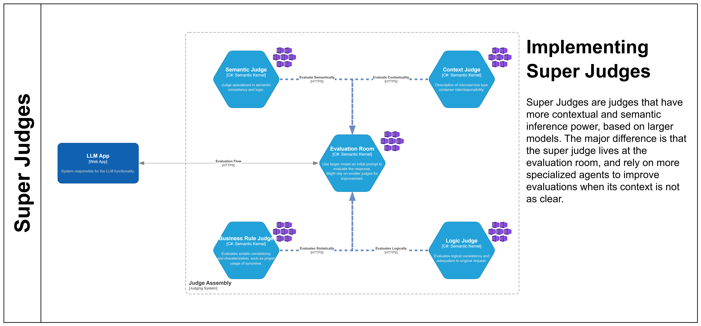

# LLM as Judge

LLM as Judge is a framework for implementing a pattern where Large Language Models (LLMs) act as judges to evaluate content, responses, or code based on defined criteria. This project provides a complete solution with API endpoints, Azure deployment support, and configurable judge assemblies.

## Features

- **Judge Orchestration**: Create and manage multiple judges with different evaluation criteria
- **Assembly System**: Group judges into assemblies for comprehensive evaluations
- **FastAPI Backend**: RESTful API for managing judges and performing evaluations
- **Azure Integration**: Built-in support for Azure Cognitive Services, Cosmos DB, and Container Apps
- **Statistical Analysis**: Includes plugins for statistical analysis and data operations
- **Infrastructure as Code**: Terraform support for easy deployment to Azure

## Architecture

The system consists of:

1. **Judges**: Individual LLM instances configured with specific evaluation criteria
2. **Assemblies**: Collections of judges that work together to provide comprehensive evaluations
3. **API Layer**: FastAPI application for managing judges and assemblies, and processing evaluation requests
4. **Storage Layer**: Azure Cosmos DB for storing judge configurations and evaluation results
5. **Plugins**: Extensions for statistical analysis, data processing, and other functions

## Judge Visualization

The LLM as Judge framework offers two distinct visual approaches:

### Judge Assembly

This approach groups multiple specialized judges into assemblies that handle different evaluation criteria. It promotes modularity, allowing tailored assemblies for various tasks.



### Super Judge

The Super Judge model centralizes the evaluation process within a single, advanced judge. It streamlines management while integrating multiple evaluation strategies.



Each approach presents unique advantages. The Judge Assembly enables flexible scalability and specialization, whereas the Super Judge focuses on simplicity and unified decision-making.

## Getting Started

### Prerequisites

- Python 3.12 or higher
- Poetry for dependency management
- Azure account with necessary permissions
- Azure CLI installed
- Terraform installed

### Local Setup

1. Clone the repository:

```bash
git clone https://github.com/your-username/llm-as-judge.git
cd llm-as-judge
```

2. Navigate to the source directory and install dependencies:

```bash
cd src
poetry install
```

3. Configure the environment (optional):

```powershell
./configuration/conf-env.ps1
```

4. Run linters to verify code quality (optional):

```powershell
./configuration/linters.ps1
```

### Running the Service

#### Using Poetry (Recommended)

1. Navigate to the src directory:

```bash
cd src
```

2. Start the FastAPI development server:

**On Windows (PowerShell):**
```powershell
poetry run uvicorn app.main:app --reload --host 0.0.0.0 --port 8000
```

**On Windows (Command Prompt) or Unix/Linux:**
```bash
poetry run uvicorn app.main:app --reload --host 0.0.0.0 --port 8000
```

3. The API will be available at:
   - **API**: http://localhost:8000
   - **Interactive API Documentation**: http://localhost:8000/docs
   - **Alternative API Documentation**: http://localhost:8000/redoc

#### Alternative Method

If you prefer to activate the virtual environment first:

```bash
cd src
poetry shell
uvicorn app.main:app --reload --host 0.0.0.0 --port 8000
```

### Environment Configuration

Before running the service, ensure you have the necessary environment variables configured:

- Azure OpenAI endpoint and API keys
- Cosmos DB connection strings (if using persistence)
- Other Azure service configurations

You can set these in your environment or create a `.env` file in the `src` directory.

## Provisioning Infrastructure with Terraform

### Authentication

Login to your Azure account:

```
az login
```

### Configuration

1. Create a `terraform.tfvars` file based on the sample:

```
cp terraform.tfvars.sample terraform.tfvars
```

2. Edit the `terraform.tfvars` file with your subscription and tenant IDs:

```
subscription_id = "your-subscription-id"
tenant_id       = "your-tenant-id"
```

### Deployment

1. Initialize Terraform:

```
terraform init
```

2. Create an execution plan:

```
terraform plan -out=tfplan
```

3. Apply the configuration:

```
terraform apply -var-file="terraform.tfvars"
```

### Updating Existing Resources

To import existing resources into Terraform state:

```
./configuration/update-tf.ps1
```

## Using the API

The API provides several endpoints for managing judges and performing evaluations:

### Judge Configuration

- `GET /list-judges` - List all judges
- `POST /create-judge` - Create a new judge
- `PUT /update-judge/{judge_id}` - Update an existing judge
- `DELETE /delete-judge/{judge_id}` - Delete a judge

### Assembly Configuration

- `GET /list-assemblies` - List all judge assemblies
- `POST /create-assembly` - Create a new assembly
- `PUT /update-assembly/{assembly_id}` - Update an existing assembly
- `DELETE /delete-assembly/{assembly_id}` - Delete an assembly

### Judge Execution

- `POST /evaluate` - Execute a judging evaluation

### Example Evaluation Request

```json
{
  "id": "assembly_id",
  "prompt": "The content to evaluate",
  "method": "assembly"
}
```

## Development

### Project Structure

- `src/app/` - Main application code
  - `judges.py` - Judge implementation and orchestration
  - `main.py` - FastAPI application
  - `plugins/` - Additional functionality plugins
  - `schemas/` - Data models and validation
- `src/tests/` - Test cases
- `configuration/` - Setup and configuration scripts
- `terraform.tf` - Infrastructure as code

### Running Tests

```
cd src
poetry run pytest
```
